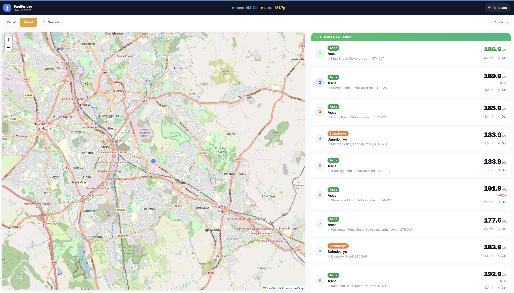

# FuelFinder

FuelFinder is a live UK fuel price tracker that shows you the cheapest petrol and diesel stations near your current location. It pulls real-time prices directly from retailer feeds that are legally required to publish up-to-date pump prices under the UK Competition and Markets Authority (CMA) mandate.

Open the app, allow location access, and instantly see every nearby station ranked by price — with an interactive map, savings comparisons, and one-tap directions.



---

## How it works

1. **Location** — the browser requests your GPS coordinates. A fast network fix is returned immediately, then silently upgraded to a more accurate GPS fix in the background.

2. **Price fetch** — your coordinates and chosen radius are sent to the `/api/fuel-prices` route. The server fetches all active CMA retailer feeds in parallel (using `Promise.allSettled` so a single broken feed never blocks the rest), normalises every station into a common schema, and caches the result for 15 minutes using Next.js `unstable_cache`. Subsequent requests within that window are served instantly from cache.

3. **Filtering & ranking** — stations are filtered to your radius using the Haversine formula (distances in miles), sorted by price or distance, and capped at 50 results to keep payloads small.

4. **Display** — the list view ranks stations cheapest-first with a savings badge showing how much more each station costs vs the cheapest. The map view renders colour-coded price labels for every brand. Switching tabs on mobile triggers `invalidateSize()` on the Leaflet map so tiles render correctly.

---

## What it does

- Detects your location and finds all fuel stations within a chosen radius
- Shows live petrol and diesel prices, refreshed every 15 minutes server-side
- Ranks stations cheapest to most expensive with savings comparisons (e.g. +2.1p vs cheapest)
- Displays stations on an interactive map with brand-coloured price labels
- Switch between petrol and diesel, sort by price or distance, and adjust the radius from 2 to 30 miles
- One-tap Google Maps directions from any station
- Fully mobile-friendly with a bottom tab bar and safe-area insets for iPhone

---

## Getting started

### Prerequisites

- [Node.js](https://nodejs.org) v18 or higher
- npm (comes with Node.js)

### 1. Clone the repo

```bash
git clone https://github.com/islas104/fuel-price-tracker.git
cd fuel-price-tracker
```

### 2. Install dependencies

```bash
npm install
```

### 3. Run the development server

```bash
npm run dev
```

Open [http://localhost:3000](http://localhost:3000) in your browser and allow location access when prompted. No API keys or accounts required — it works out of the box.

---

## Tech stack

| Layer | Technology |
|---|---|
| Framework | [Next.js 14](https://nextjs.org) (App Router, server components, API routes) |
| Language | TypeScript |
| Styling | [Tailwind CSS](https://tailwindcss.com) |
| Map | [Leaflet](https://leafletjs.com) + [OpenStreetMap](https://openstreetmap.org) (dynamic import, SSR disabled) |
| Icons | [Lucide React](https://lucide.dev) |
| Caching | Next.js `unstable_cache` — survives serverless cold starts on Vercel |
| Data | UK CMA open retailer feeds (no API key required) |

---

## Data sources

Prices are fetched server-side from CMA-mandated retailer feeds. UK law requires fuel retailers to publish their pump prices and update them within 30 minutes of any change. All feeds are standard JSON — no scraping required.

| Retailer | Approx. stations |
|---|---|
| Motor Fuel Group (MFG) | ~1,223 |
| Jet | ~370 |
| Asda | ~650 |
| Sainsbury's | ~320 |
| BP | ~300 |
| Rontec | ~265 |
| SGN Retail | ~150 |
| Ascona | ~60 |
| Moto | ~50 |
| **Total** | **~3,400** |

Retailers not included: Shell and Tesco block all server-side requests (403 / Akamai WAF). Morrisons' feed only returns one station. Esso's direct feed is updated infrequently.

---

## Project structure

```
src/
├── app/
│   ├── api/fuel-prices/route.ts   # Server route — fetches, caches, filters stations
│   ├── components/
│   │   ├── FuelMap.tsx            # Leaflet map with brand-coloured markers
│   │   ├── StationCard.tsx        # Individual station row with price + directions
│   │   └── SkeletonCard.tsx       # Loading placeholder
│   ├── opengraph-image.tsx        # Auto-generated OG share image (Next.js ImageResponse)
│   ├── layout.tsx                 # Root layout, metadata, OG tags
│   ├── page.tsx                   # Main page — geolocation, state, list/map toggle
│   └── globals.css                # Leaflet CSS import + Tailwind + safe-area utilities
└── lib/
    └── fuel-sources.ts            # Feed URLs, FuelStation type, haversine, normaliseStation
```
